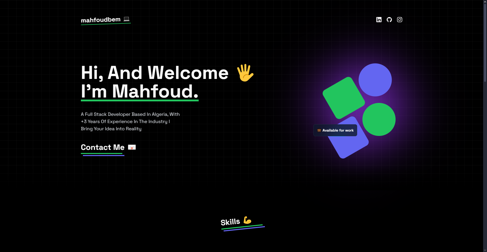

I'm thrilled to share that I’ve just completed a new project: a responsive website built with Next.js, TypeScript, Tailwind CSS, and Aceternity UI! 🎉

This project marks my entry into using Next.js and TypeScript, and it has been an amazing learning journey. Big shoutout to Chen Sokheng and his Daily Web Coding channel for the fantastic tutorial that guided me through this process.

Check out the live demo and source code below:
🔗 Live Demo: https://mahfoudbem-next-js-learning.vercel.app

I’m excited to continue building with these technologies and to apply what I’ve learned in future projects. Feedback and suggestions are always welcome!

### Screenshot of the hero section:

